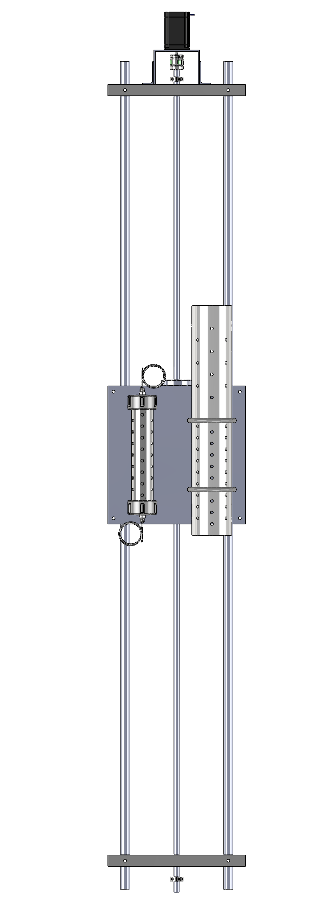

# **Development of next-generation autonomous sensing platforms for water quality monitoring and HAB detection**  

## **1. Overview**  
The **Development of Next-Generation Autonomous Sensing Platforms for Water Quality Monitoring and HAB Detection** project is funded by the **Florida Department of Environmental Protection (FDEP)** and developed by researchers at **Florida International University (FIU)**.  

This project consists of **a distributed array of eight autonomous sensing platforms** deployed in **Biscayne Bay** to enhance water quality monitoring and **harmful algal bloom (HAB) detection**. Unlike traditional fixed monitoring stations, these platforms remain stationary while their sensors move **vertically within a 1.40 m range**, allowing measurements at different depths. This dynamic sensing capability provides a more comprehensive understanding of water quality variations and tidal influences.  

The focus of this repository is to present **sensor data visualization** through interactive charts, providing an intuitive way to analyze environmental parameters collected by the deployed platforms.    

## **2. Technologies Used**  
- **Programming Language:** Python  
- **Hardware:** Raspberry Pi, NEMA 23 stepper motor, DM556T digital stepper driver, EXO2 sensor, BulletCAT12 LTE Modem/Gateway 
- **Libraries:** Plotly, Streamlit, Pymongo, Pandas, Pydeck

## **3. Functionalities**  

### 📡 Data Collection  
Measures the following water quality parameters in real-time:  
- **Temperature**  
- **Salinity**  
- **Conductance**  
- **Oxygen Demand (ODO)**  
- **Turbidity**  

### 🔄 Depth Control  
The sensor adjusts its position vertically within a 1.40 m range, enabling measurements at various water depths. The use of a stepper motor ensures precise control of depth, enhancing the accuracy of the measurements.  

### 📊 Interactive Visualization  
Generates dynamic charts for each water quality parameter (temperature, salinity, conductance, ODO, and turbidity), along with depth data. Users can interactively explore the relationship between these parameters and depth over time.    

## **4. Project Structure**  
```plaintext
📂 src                # Source code  
 ┣ platform_data.py   # Main Python script  
 📂 images            # Images and diagrams 
 📂 videos           # Folder for project videos
README.md             # Main documentation  
requirements.txt      # Project dependencies  
.gitignore            # Git ignore file  
```

### 🌍 Platform Locations  
Below is a map showing the installation locations of the eight sensing platforms in Biscayne Bay:

### 🚢 Platform Image  
Here is an image of one of the sensing platforms used in the project:

